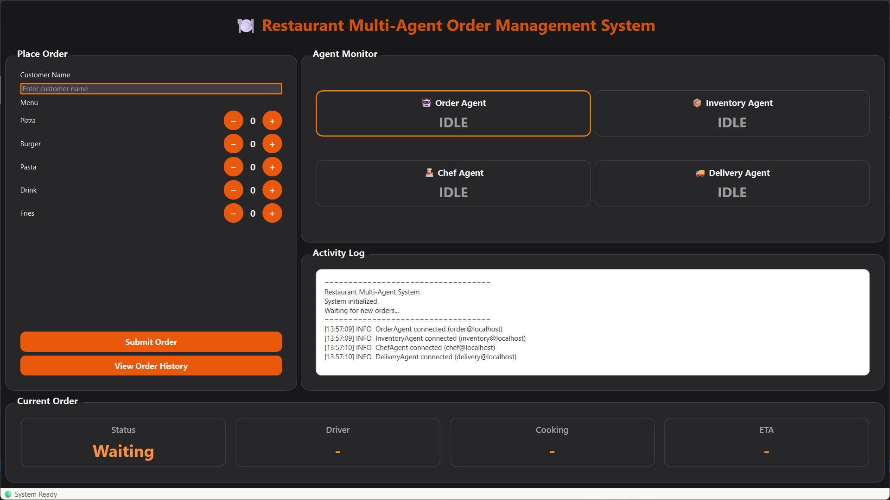
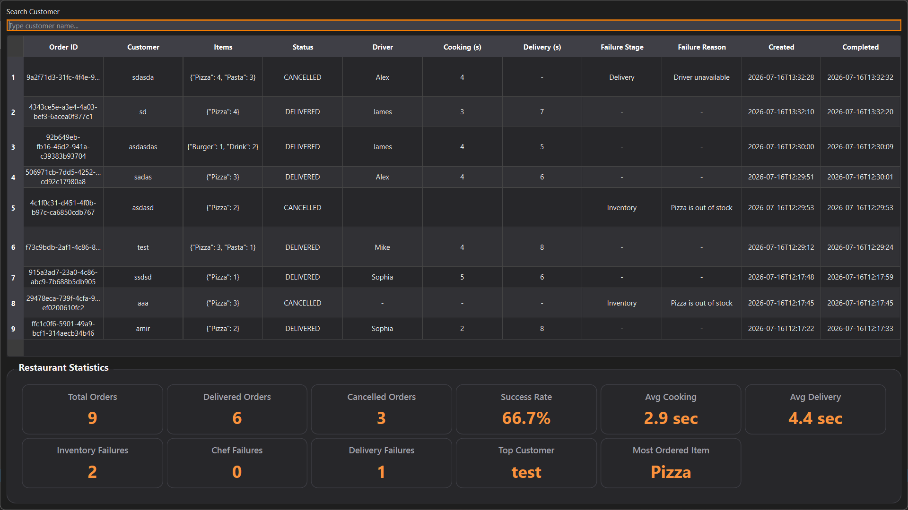

# 🍔 Restaurant Multi-Agent Order Management System

A desktop-based **Restaurant Order Management System** built with **Python**, **SPADE (XMPP Multi-Agent System)**, **PySide6**, and **SQLite**.

The application simulates how independent software agents collaborate to process restaurant orders from creation to delivery while providing a modern desktop dashboard for monitoring the entire workflow.

---

## 📸 Screenshots

### Dashboard



### Order History



---

## 📹 Video

### Demo


---
# ✨ Features

## 🤖 Multi-Agent Architecture

The system is composed of four autonomous SPADE agents.

- 🧾 Order Agent
- 📦 Inventory Agent
- 👨‍🍳 Chef Agent
- 🚚 Delivery Agent

Each agent has its own responsibility and communicates exclusively through XMPP messages.

---

## 🍕 Order Processing Workflow

```text
Customer
    │
    ▼
Order Agent
    │
    ▼
Inventory Agent
    │
    ▼
Chef Agent
    │
    ▼
Delivery Agent
    │
    ▼
Delivered / Failed
```

Each order progresses through realistic restaurant stages.

---

## ⚡ Agent Communication

Agents communicate using SPADE messages with custom performatives.

Examples include:

- CHECK_INVENTORY
- INVENTORY_OK
- PREPARE_ORDER
- ORDER_READY
- REQUEST_DELIVERY
- DELIVERED

---

## 🎲 Realistic Simulation

Every order behaves differently.

### Cooking Time

Randomized

```
2–5 seconds
```

### Delivery Time

Randomized

```
4–8 seconds
```

### Driver Assignment

Random delivery driver selected for every order.

Example:

- Mike
- Emma
- James
- Sophia
- Alex

---

## ❌ Failure Simulation

The system can simulate real restaurant failures.

Examples include

- Inventory unavailable
- Chef unavailable
- Delivery failure

Cancelled orders include a stored failure reason.

---

# 🖥 Desktop Dashboard

The PySide6 desktop interface includes:

- 🍔 Order creation form
- 🤖 Live agent monitor
- 📜 Activity log
- 📊 Result panel
- 📈 Statistics dashboard
- 📚 Order history

Everything updates live through Qt signals.

---

# 📊 Statistics

The History window automatically calculates:

- Total Orders
- Delivered Orders
- Cancelled Orders
- Success Rate
- Inventory Failures
- Chef Failures
- Delivery Failures
- Average Cooking Time
- Average Delivery Time
- Top Customer
- Most Ordered Menu Item

---

# 📚 Order History

Every completed or cancelled order is stored inside SQLite.

Stored information includes:

- Order ID
- Customer
- Items
- Status
- Failure Reason
- Assigned Driver
- Cooking Time
- Delivery Time
- Created Time
- Completed Time

Orders can be searched by customer name.

---

# 🗄 Database

SQLite is used for persistent storage.

Example schema:

```sql
orders
------
id
order_id
customer
items
status
failure_reason
driver
cooking_time
delivery_time
created_at
completed_at
```

---

# 🧠 Technologies

| Technology | Purpose |
|------------|---------|
| Python 3 | Programming Language |
| SPADE | Multi-Agent Framework |
| XMPP | Agent Communication |
| PySide6 | Desktop GUI |
| SQLite | Database |
| Qt Style Sheets (QSS) | UI Styling |

---

# 📂 Project Structure

```text
Restaurant-Multi-Agent-Order-Management-System
│
├── agents/
│   ├── behaviours/
│   ├── base_agent.py
│   ├── chef_agent.py
│   ├── delivery_agent.py
│   ├── inventory_agent.py
│   └── order_agent.py
│
├── assets/
│   ├── restaurant.jpg
│   └── styles/
│
├── config/
│
├── database/
│   ├── connection.py
│   ├── init_db.py
│   └── repository.py
│
├── gui/
│   ├── widgets/
│   ├── history_window.py
│   ├── main_window.py
│   └── style_loader.py
│
├── messaging/
│
├── models/
│
├── services/
│
├── main.py
│
└── README.md
```

---

# 🚀 Installation

## Clone the repository

```bash
git clone https://github.com/yourusername/Restaurant-Multi-Agent-Order-Management-System.git

cd Restaurant-Multi-Agent-Order-Management-System
```

---

## Create virtual environment

```bash
python -m venv .venv
```

Windows

```bash
.venv\Scripts\activate
```

Linux / macOS

```bash
source .venv/bin/activate
```

---

## Install dependencies

```bash
pip install -r requirements.txt
```

---

## Initialize the database

```bash
python database/init_db.py
```

---

## Start XMPP Server

Run your local Prosody server.

Default agents:

```text
order@localhost

inventory@localhost

chef@localhost

delivery@localhost
```

---

## Run the application

```bash
python main.py
```

---

# 🎯 Learning Objectives

This project demonstrates practical knowledge of:

- Multi-Agent Systems
- Agent Communication
- Distributed System Design
- Event-Driven Programming
- Desktop Application Development
- GUI Design
- SQLite Integration
- Object-Oriented Programming
- Software Architecture
- Message Passing

---

# 📈 Future Improvements

- Export history to CSV
- Order details window
- Charts and analytics
- Agent queue visualization
- Multiple delivery drivers
- Menu management
- Theme switcher
- Docker support
- Automated tests

---

# 👨‍💻 Author

**Amirali Mehdipour**

Master's Student in Artificial Intelligence

GitHub:
https://github.com/amirali4602

Linkedin:
linkedin.com/in/amirali-mehdipour

---

# 📄 License

This project is licensed under the MIT License.